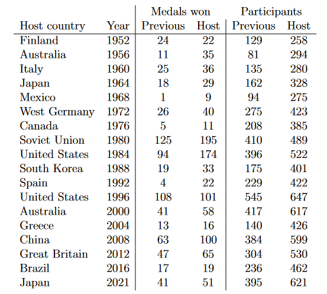

The “2020” Summer Olympic games concluded just a few months ago, and the
2022 Winter Olympic games are drawing to a close. It seems like a good
time to examine the question “Does home-field advantage exist in the
Olympics?” This research question is inspired by these articles from
[NPR](https://www.npr.org/sections/tokyo-olympics-live-updates/2021/08/07/1025452727/how-home-field-advantage-gives-olympic-host-countries-an-edge-and-more-gold-medals)
and
[FiveThirtyEight](https://fivethirtyeight.com/features/is-there-home-field-advantage-at-the-olympics/).

Here is the data:

Here’s the analysis using Bayesian methods: [Home-Field Advantage in the
Summer
Olympics](https://github.com/not-that-john-williams/olympics-bayesian/blob/853de9d1b9f357f8dd70c9634c6f32e7af747490/Home-Field-Advantage-in-the-Summer-Olympics.md)
