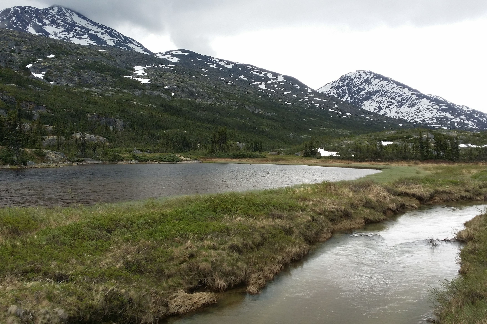
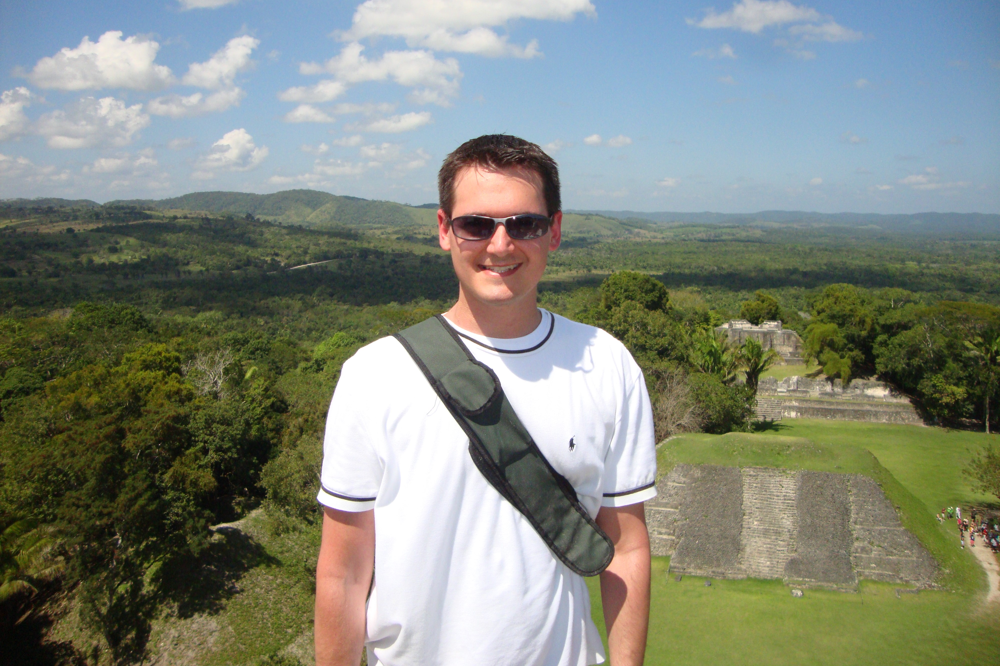
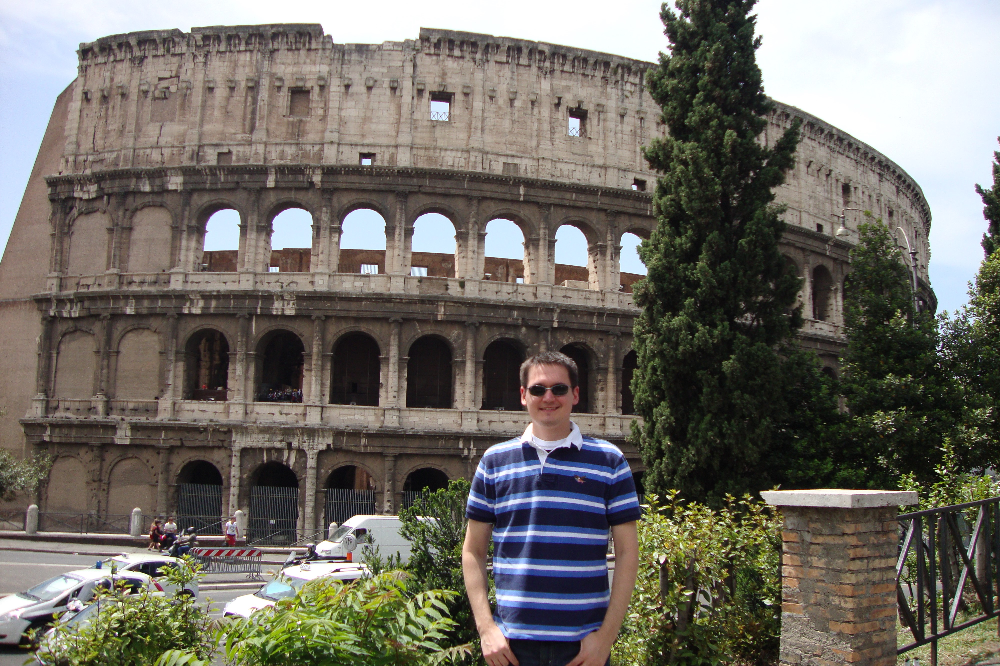
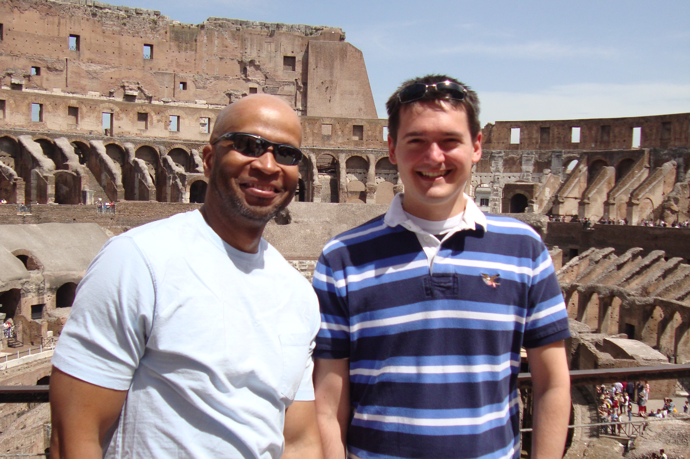
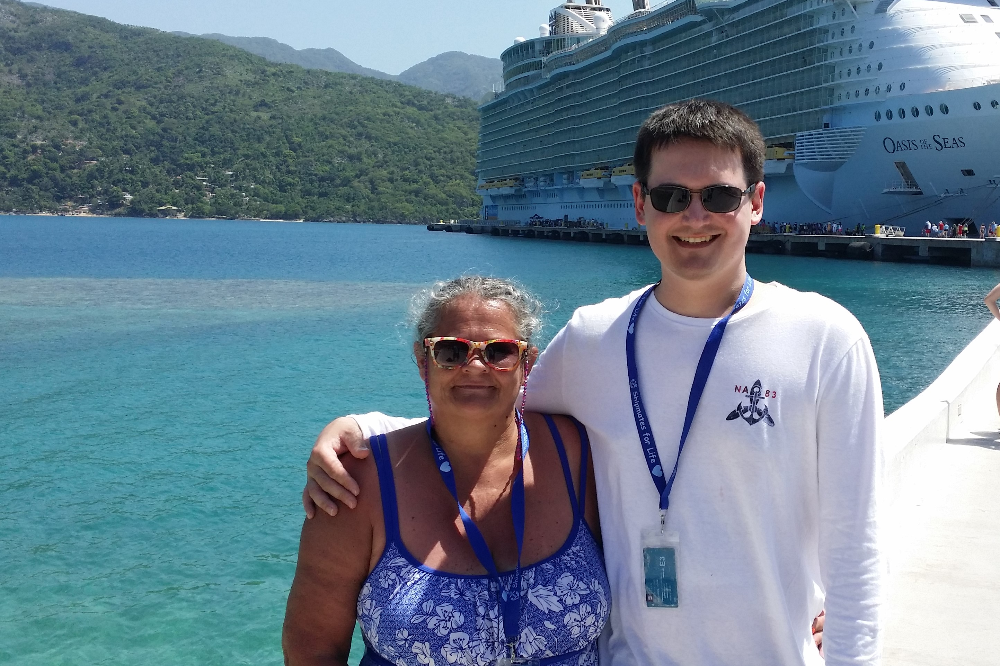

## Hi!  My name is John Williams! { .tabset .tabset-pills }  

After 15+ years as an engaging, results-driven leader within the retail industry, I'm in the middle of a career transition.  In 2020, I decided to make a bold move.  I'm currently continuing my education, pursuing a Masters of Statistics at North Carolina State University.  I'm excited to find out where the next 20+ years of my career take me!

### Education and Experience

* Bachelors of Science, Applied Mathematics (Old Dominion Univeristy - 2007)
* JCPenney
    - Assistant Store Manager - Richmond, VA (2008-2012)
    - Store Leader - Danville, VA (2012 - 2015)
    - District Merchandise Manager - Winston-Salem, NC (2015-2017)
    - General Manager - Danville, VA (2017 - 2020)
* Belk
    - Assistant Store Manager - Greensboro, NC (2017)

### Travel

Where have you travelled to...

{:height="180px" width="270px"} {:height="180px" width="270px"} {:height="180px" width="270px"}  
{:height="180px" width="270px"} {:height="180px" width="270px"} 

### Minecraft

Examples of builds...

### Contact me

[jwilli32@ncsu.edu](mailto:jwilli32@ncsu.edu)
