## Hi!  My name is John Williams!

After 15+ years as an engaging, results-driven leader within the retail industry, I'm in the middle of a career transition.  In 2020, I decided to make a bold move.  I'm currently continuing my education, pursuing a Masters of Statistics at North Carolina State University.  I'm excited to find out where the next 20+ years of my career take me!

### Education and Experience

* Bachelors of Science, Applied Mathematics (Old Dominion Univeristy - 2007)
* JCPenney
    - Assistant Store Manager - Richmond, VA (2008-2012)
    - Store Leader - Danville, VA (2012 - 2015)
    - District Merchandise Manager - Winston-Salem, NC (2015-2017)
    - General Manager - Danville, VA (2017 - 2020)
* Belk
    - Assistant Store Manager - Greensboro, NC (2017)

### Travel

Here are a few of the fascinating places I've been fortunate to visit!

[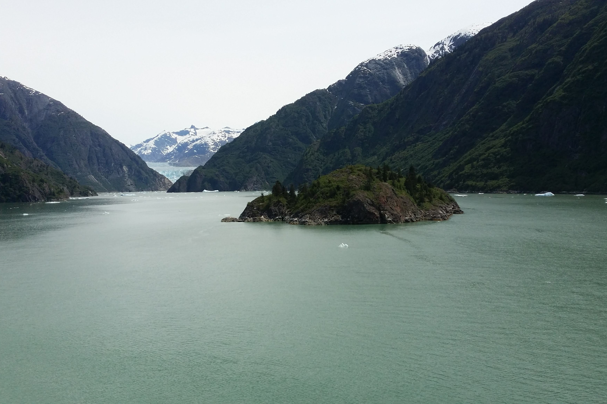{:height="140px" width="210px"}](https://www.google.com/maps/place/Tracy+Arm/@57.8503894,-133.6521792,10z) [{:height="140px" width="210px"}](https://www.google.com/maps/place/Chichén+Itzá/@20.6829614,-88.5746156,4139m) [{:height="140px" width="210px"}](https://www.google.com/maps/place/Colosseum/@41.8902142,12.4900422,17z/)  
*Tracy Arm Fjord, Alaska* *Chichén+Itzá, Belize* *Rome, Italy*  
{:height="140px" width="210px"} [{:height="140px" width="210px"}](https://www.google.com/maps/place/Labadee+Haïti/@19.7815959,-72.2469786,3210m) [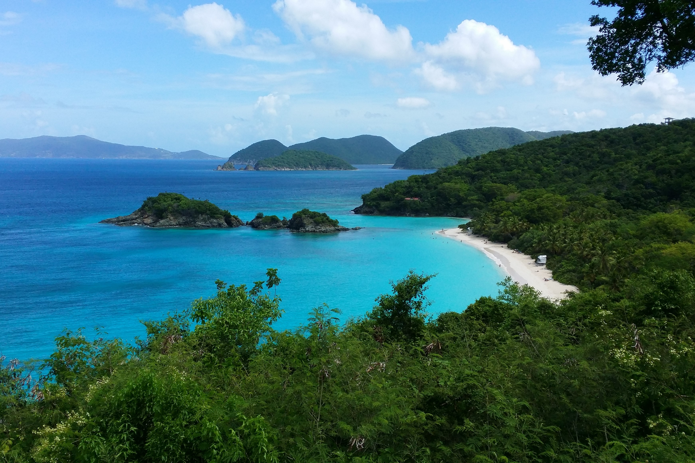{:height="140px" width="210px"}](https://www.google.com/maps/place/Trunk+Bay/@18.3526056,-64.7696255,991m)  
[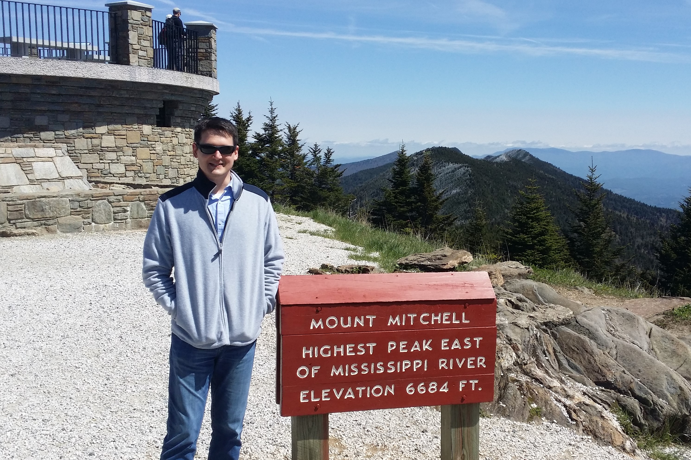{:height="140px" width="210px"}](https://www.google.com/maps/place/Mt+Mitchell/@35.7646309,-82.2678989,3589m) [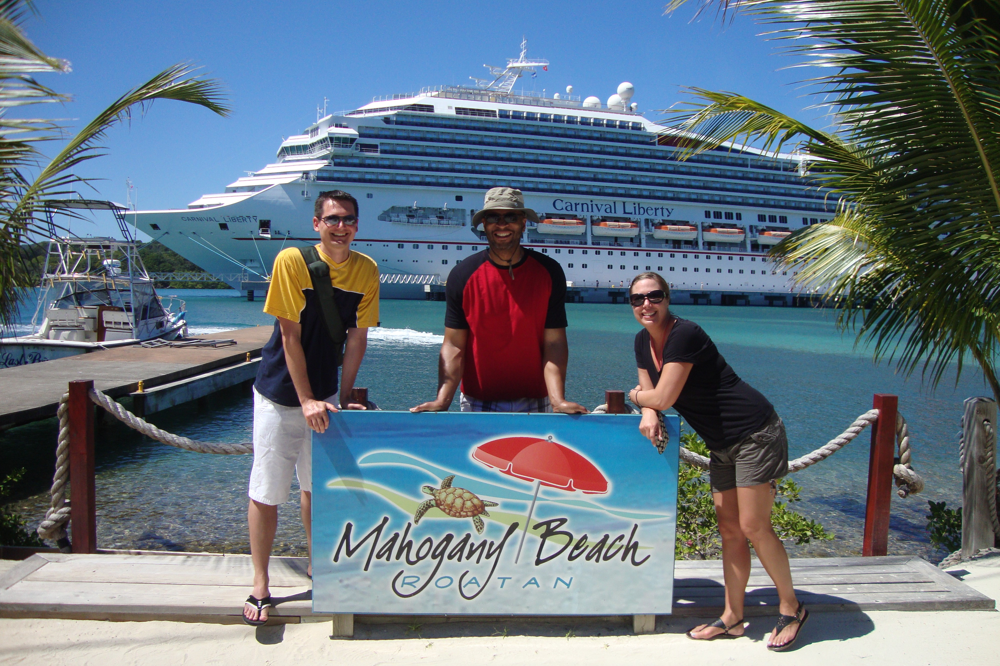{:height="140px" width="210px"}](https://www.google.com/maps/place/Roatán/@16.3459564,-86.4390788,37032m) [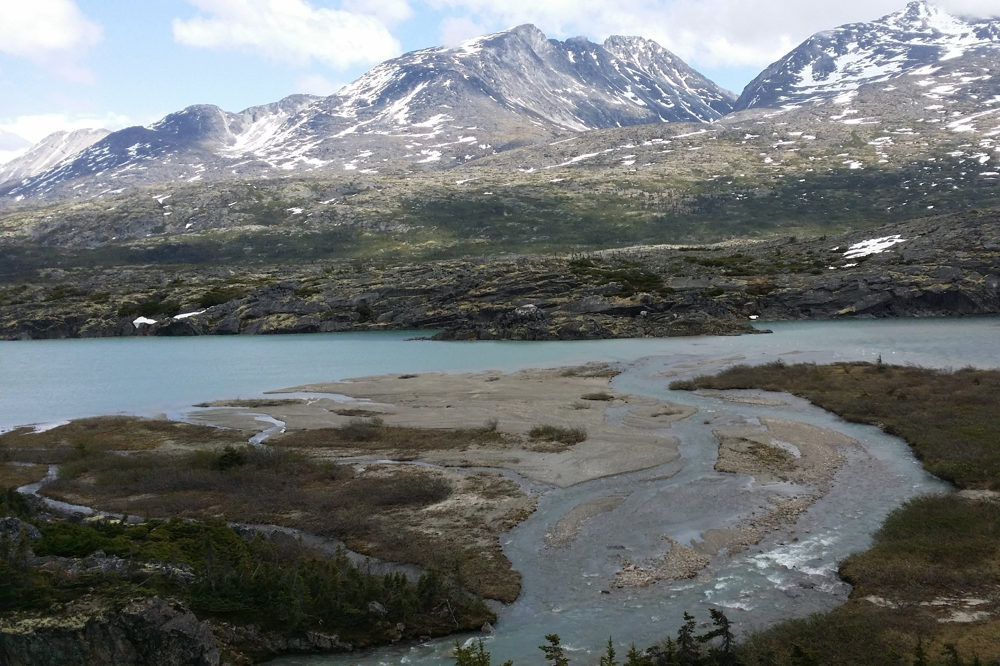{:height="140px" width="210px"}](https://www.google.com/maps/place/White+Pass/@59.6209935,-135.0801651,17897m)  
[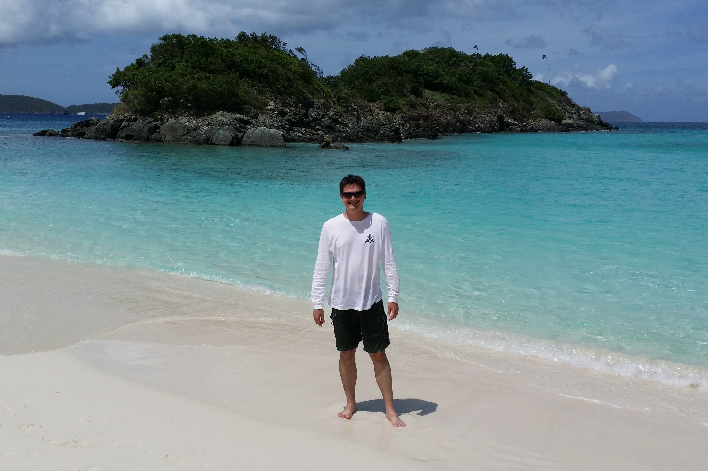{:height="140px" width="210px"}]((https://www.google.com/maps/place/Trunk+Bay/@18.3526056,-64.7696255,991m)) [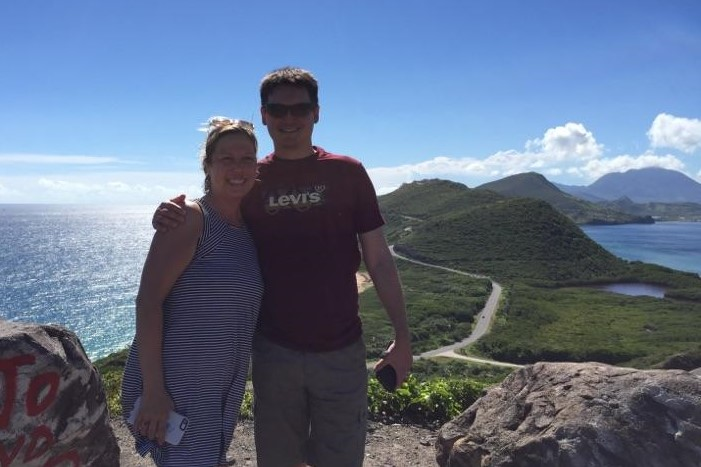{:height="140px" width="210px"}](https://www.google.com/maps/place/Saint+Kitts/@17.3153726,-62.8828814,67570m) [{:height="140px" width="210px"}](https://www.google.com/maps/place/Mendenhall+Glacier/@58.434765,-134.556738,4631m)
[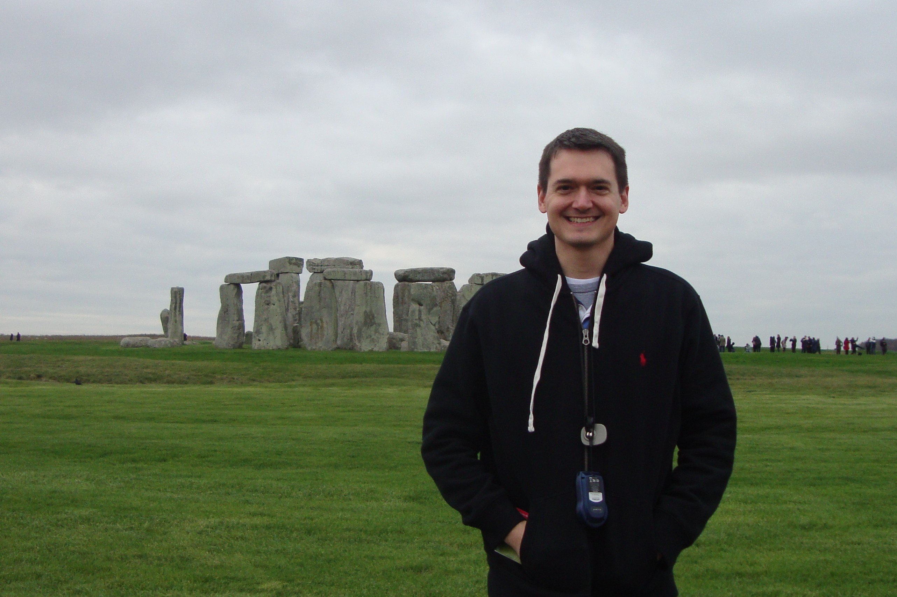{:height="140px" width="210px"}](https://www.google.com/maps/place/Stonehenge/@51.178905,-1.8327997,2773m) [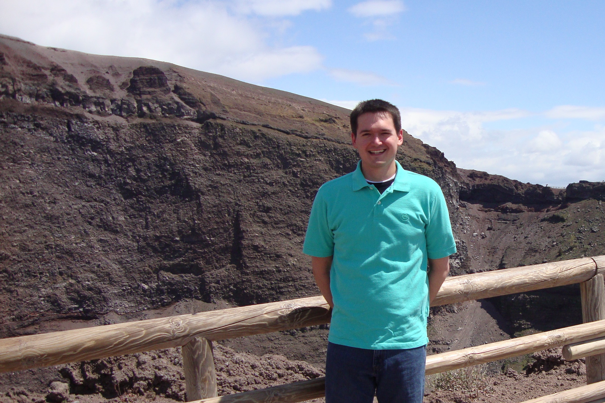{:height="140px" width="210px"}](https://www.google.com/maps/place/Mount+Vesuvius/@40.8223812,14.4113962,6695m) [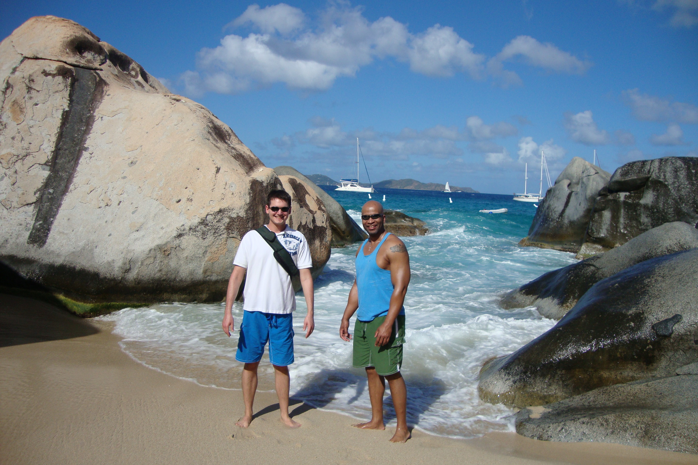{:height="140px" width="210px"}](https://www.google.com/maps/place/The+Baths/@18.430002,-64.446344,2098m)  
[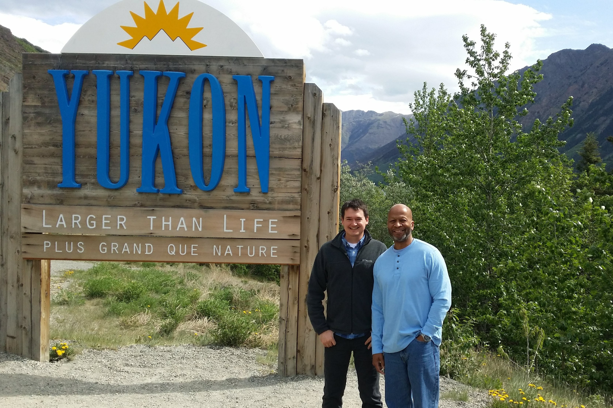{:height="140px" width="210px"}](https://www.google.com/maps/place/Yukon+Larger+than+Life+Sign/@59.999337,-134.6668446,1106m) [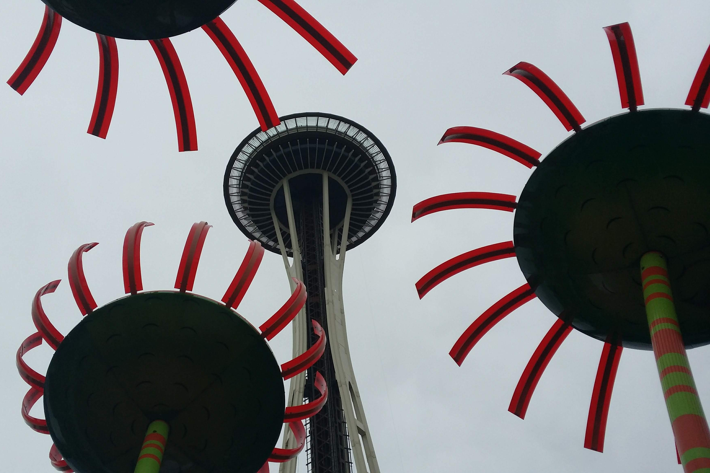{:height="140px" width="210px"}](https://www.google.com/maps/place/Space+Needle/@47.6205063,-122.3514661,745m) 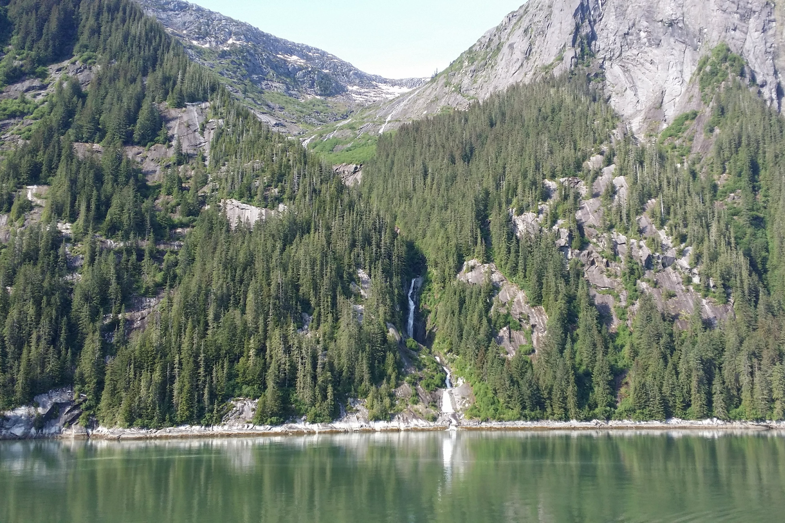{:height="140px" width="210px"}

### Minecraft

Examples of builds...

### Contact me

[jwilli32@ncsu.edu](mailto:jwilli32@ncsu.edu)
